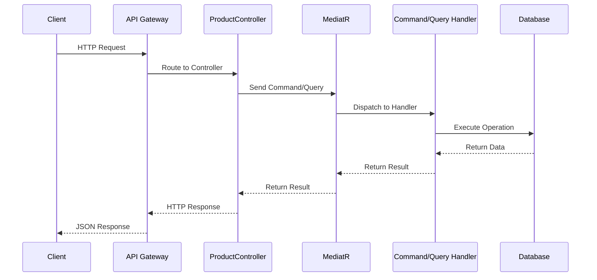
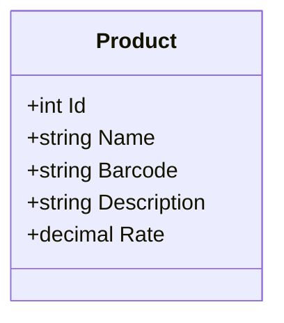
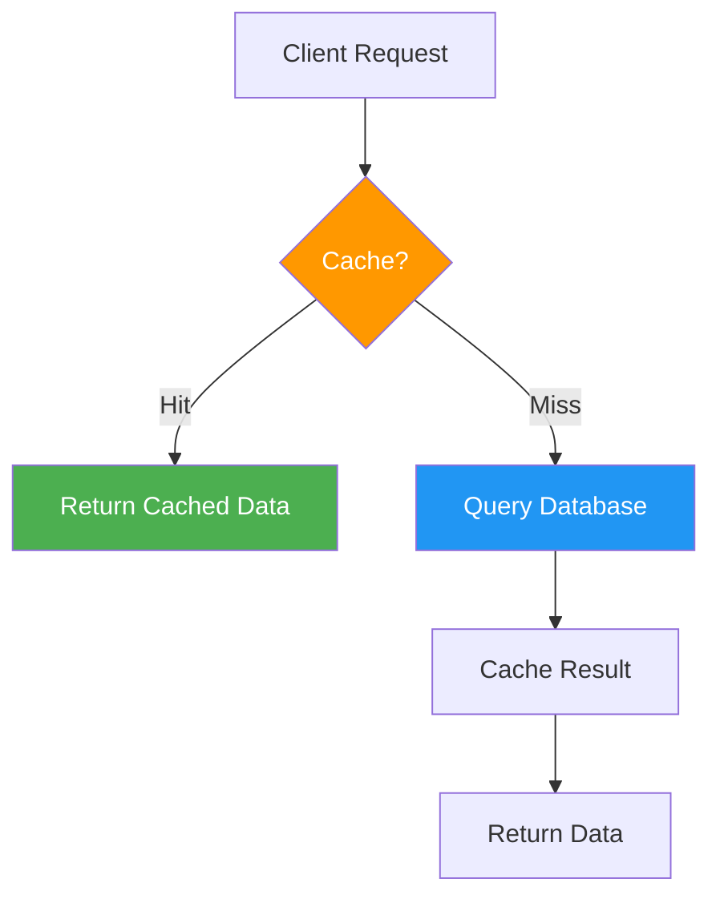

# API Documentation

## Overview

This document provides detailed information about the API endpoints, request/response formats, and usage examples.

**Base URL:** `http://localhost:5296` (HTTP) or `https://localhost:7130` (HTTPS)

**API Version:** v1.0

**Content Type:** `application/json`

## Endpoints

### Product Endpoints

#### Create Product

Creates a new product in the system.

**Endpoint:** `POST /api/v1/product`

**Request Body:**
```json
{
  "name": "Laptop",
  "barcode": "123456789",
  "description": "High-performance laptop",
  "rate": 999.99
}
```

**Response:** `200 OK`
```json
1
```
*Returns the ID of the created product*

**cURL Example:**
```bash
curl -X POST https://localhost:7130/api/v1/product \
  -H "Content-Type: application/json" \
  -d '{
    "name": "Laptop",
    "barcode": "123456789",
    "description": "High-performance laptop",
    "rate": 999.99
  }'
```

---

#### Get All Products

Retrieves all products from the system.

**Endpoint:** `GET /api/v1/product`

**Response:** `200 OK`
```json
[
  {
    "id": 1,
    "name": "Laptop",
    "barcode": "123456789",
    "description": "High-performance laptop",
    "rate": 999.99
  },
  {
    "id": 2,
    "name": "Mouse",
    "barcode": "987654321",
    "description": "Wireless mouse",
    "rate": 29.99
  }
]
```

**cURL Example:**
```bash
curl -X GET https://localhost:7130/api/v1/product
```

---

#### Get Product by ID

Retrieves a specific product by its ID.

**Endpoint:** `GET /api/v1/product/{id}`

**URL Parameters:**
- `id` (integer, required) - The product ID

**Response:** `200 OK`
```json
{
  "id": 1,
  "name": "Laptop",
  "barcode": "123456789",
  "description": "High-performance laptop",
  "rate": 999.99
}
```

**cURL Example:**
```bash
curl -X GET https://localhost:7130/api/v1/product/1
```

---

#### Update Product

Updates an existing product.

**Endpoint:** `PUT /api/v1/product/{id}`

**URL Parameters:**
- `id` (integer, required) - The product ID

**Request Body:**
```json
{
  "id": 1,
  "name": "Gaming Laptop",
  "barcode": "123456789",
  "description": "High-performance gaming laptop",
  "rate": 1299.99
}
```

**Response:** `200 OK`
```json
1
```
*Returns the ID of the updated product*

**Validation:**
- The `id` in the URL must match the `id` in the request body
- If they don't match, returns `400 Bad Request`:
  ```json
  "Route id and body id do not match."
  ```

**cURL Example:**
```bash
curl -X PUT https://localhost:7130/api/v1/product/1 \
  -H "Content-Type: application/json" \
  -d '{
    "id": 1,
    "name": "Gaming Laptop",
    "barcode": "123456789",
    "description": "High-performance gaming laptop",
    "rate": 1299.99
  }'
```

---

#### Delete Product

Deletes a product by its ID.

**Endpoint:** `DELETE /api/v1/product/{id}`

**URL Parameters:**
- `id` (integer, required) - The product ID

**Response:** `200 OK`
```json
1
```
*Returns the ID of the deleted product*

**cURL Example:**
```bash
curl -X DELETE https://localhost:7130/api/v1/product/1
```

---

## Request Flow Diagram



## Data Models

### Product



**Properties:**

| Property | Type | Required | Description |
|----------|------|----------|-------------|
| `id` | integer | Yes | Unique identifier (auto-generated) |
| `name` | string | Yes | Product name |
| `barcode` | string | Yes | Product barcode |
| `description` | string | Yes | Product description |
| `rate` | decimal | Yes | Product price |

## Error Handling

### Current Implementation

Currently, the API returns raw exceptions. Error responses may vary depending on the error type.

**Common Error Scenarios:**

1. **Product Not Found** (when querying/updating/deleting non-existent ID)
   - May throw exception or return null

2. **Validation Errors** (invalid data in request)
   - Currently handled by ASP.NET Core model validation

3. **Database Errors** (connection issues, constraint violations)
   - Returns 500 Internal Server Error

### Recommended Enhancement

Implement a standardized error response format:

```json
{
  "succeeded": false,
  "data": null,
  "errors": [
    "Product with ID 999 not found"
  ],
  "message": "The requested product could not be found"
}
```

## Testing the API

### Using Swagger UI

1. Start the application:
   ```bash
   cd src/Presentation/WebApi
   dotnet run
   ```

2. Navigate to Swagger UI:
   ```
   https://localhost:7130/swagger
   ```

3. Explore and test endpoints interactively

### Using Postman

1. Import the base URL: `https://localhost:7130`
2. Create requests for each endpoint
3. Set `Content-Type: application/json` header
4. Add request bodies as needed

### Sample Test Workflow

```bash
# 1. Create a product
curl -X POST https://localhost:7130/api/v1/product \
  -H "Content-Type: application/json" \
  -d '{"name":"Test Product","barcode":"TEST123","description":"Test","rate":10.00}'

# 2. Get all products
curl https://localhost:7130/api/v1/product

# 3. Get product by ID
curl https://localhost:7130/api/v1/product/1

# 4. Update product
curl -X PUT https://localhost:7130/api/v1/product/1 \
  -H "Content-Type: application/json" \
  -d '{"id":1,"name":"Updated Product","barcode":"TEST123","description":"Updated","rate":15.00}'

# 5. Delete product
curl -X DELETE https://localhost:7130/api/v1/product/1
```

## API Versioning

The API uses URL-based versioning. To create a new API version:

1. Create a new controller folder: `Controllers/v2/`
2. Add `[ApiVersion("2.0")]` attribute to controllers
3. Update Swagger configuration to include v2

**Version Header:**
The API also reports available versions in the response headers:
- `api-supported-versions`: Lists all supported versions
- `api-deprecated-versions`: Lists deprecated versions (if any)

## CORS Configuration

Currently, CORS is not configured. To enable CORS for client applications:

```csharp
// In Program.cs
builder.Services.AddCors(options =>
{
    options.AddPolicy("AllowAll", policy =>
    {
        policy.AllowAnyOrigin()
              .AllowAnyMethod()
              .AllowAnyHeader();
    });
});

// Add middleware
app.UseCors("AllowAll");
```

## Rate Limiting

Currently, no rate limiting is implemented. This is recommended for production environments.

## Authentication & Authorization

Currently, the API is unauthenticated. All endpoints are publicly accessible.

**Planned Enhancement:** JWT-based authentication
- Add `[Authorize]` attributes to controllers
- Implement token-based authentication
- Add user management endpoints

## Performance Considerations

### Current Performance Characteristics

1. **Database Queries:**
   - `GetAll` - Loads all products (no pagination)
   - `GetById` - Single query by primary key

2. **No Caching:**
   - All requests hit the database
   - Consider adding caching for frequently accessed data

### Recommended Improvements



**Suggestions:**
- Add pagination to `GetAll` endpoint
- Implement response caching for GET requests
- Add query filters and sorting
- Consider adding ETag support for conditional requests

## API Best Practices

✅ **Currently Implemented:**
- RESTful endpoint design
- Consistent URL patterns
- API versioning
- Swagger documentation
- Async/await throughout

❌ **Not Yet Implemented:**
- Pagination
- Filtering and sorting
- Field selection (partial responses)
- HATEOAS links
- Rate limiting
- Response caching
- Global error handling
- Request validation
- Logging and monitoring

---

## Quick Reference

| Method | Endpoint | Purpose |
|--------|----------|---------|
| `POST` | `/api/v1/product` | Create product |
| `GET` | `/api/v1/product` | Get all products |
| `GET` | `/api/v1/product/{id}` | Get product by ID |
| `PUT` | `/api/v1/product/{id}` | Update product |
| `DELETE` | `/api/v1/product/{id}` | Delete product |

**Swagger URL:** `https://localhost:7130/swagger`

**Supported Content Types:**
- Request: `application/json`
- Response: `application/json`
