# System Architecture Documentation

## Table of Contents

- [Overview](#overview)
- [Architecture Pattern](#architecture-pattern)
- [Layer Architecture](#layer-architecture)
- [Request Flow](#request-flow)
- [CQRS Pattern](#cqrs-pattern)
- [Database Architecture](#database-architecture)
- [API Design](#api-design)
- [Dependency Injection](#dependency-injection)
- [Future Enhancements](#future-enhancements)

## Overview

This project implements a Clean/Onion Architecture pattern for a .NET 10 Web API. The architecture promotes separation of concerns, testability, and maintainability by organizing code into concentric layers with strict dependency rules.

**Key Principles:**

- Dependencies point inward (outer layers depend on inner layers, never the reverse)
- Domain layer has no external dependencies
- Infrastructure concerns are isolated from business logic
- Business logic is framework-agnostic

## Architecture Pattern

### Onion Architecture Layers

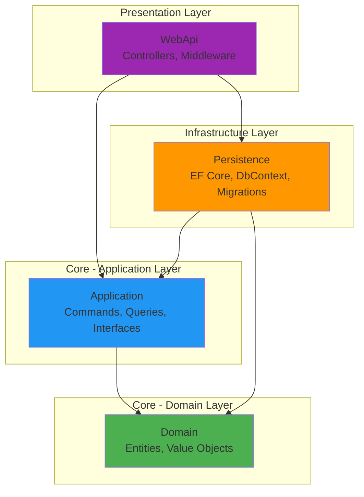

### Dependency Flow

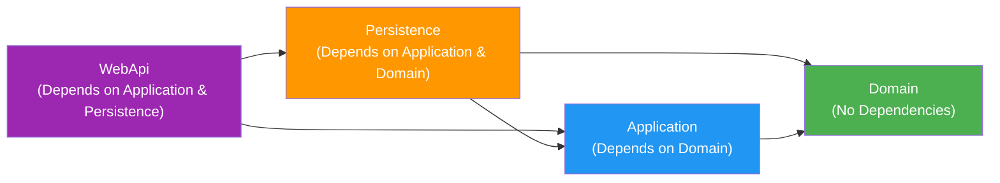

## Layer Architecture

### 1. Domain Layer (Core)

**Location:** `src/Core/Domain/`

**Purpose:** Contains enterprise business rules and entities. This is the heart of the application with zero external dependencies.

**Components:**

- `Common/BaseEntity.cs` - Base class for all entities with common properties (Id)
- `Entities/Product.cs` - Domain entities representing business objects

**Rules:**

- No dependencies on other layers
- No framework dependencies
- Pure C# classes
- Contains only business logic and domain rules

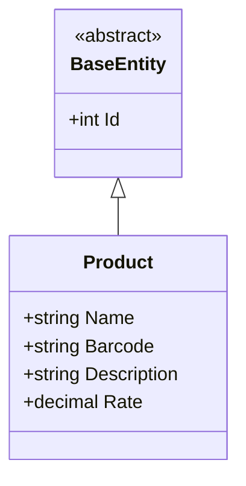

### 2. Application Layer (Core)

**Location:** `src/Core/Application/`

**Purpose:** Contains application business logic and orchestrates the flow of data. Implements CQRS pattern using MediatR.

**Components:**

- `Interfaces/` - Abstractions for infrastructure concerns (e.g., `IApplicationDbContext`)
- `Features/` - CQRS commands and queries organized by feature
- `DependencyInjection.cs` - Service registration for MediatR

**Dependencies:**

- Domain layer
- MediatR
- EntityFrameworkCore (abstractions only)

**Rules:**

- Depends only on Domain layer
- Defines interfaces for infrastructure
- No concrete infrastructure implementations
- Framework-agnostic business logic

### 3. Infrastructure Layer

**Location:** `src/Infrastructure/Persistence/`

**Purpose:** Implements data access and external service integrations. Contains concrete implementations of Application layer interfaces.

**Components:**

- `Context/ApplicationDbContext.cs` - EF Core DbContext implementation
- `Migrations/` - EF Core database migrations
- `DependencyInjection.cs` - Service registration for persistence

**Dependencies:**

- Application layer (implements its interfaces)
- Domain layer (for entity access)
- EntityFrameworkCore
- Database providers (SQLite currently)

**Rules:**

- Implements interfaces defined in Application layer
- Contains all database-specific code
- Manages migrations and database schema

### 4. Presentation Layer

**Location:** `src/Presentation/WebApi/`

**Purpose:** Exposes the application via RESTful API. Handles HTTP concerns, routing, and API versioning.

**Components:**

- `Controllers/` - API controllers
- `Controllers/BaseApiController.cs` - Base controller with MediatR integration
- `Program.cs` - Application entry point and DI configuration

**Dependencies:**

- Application layer (for commands/queries)
- Persistence layer (for DI registration)
- ASP.NET Core
- Swagger/OpenAPI
- API Versioning

**Rules:**

- Thin controllers that delegate to MediatR
- No business logic in controllers
- Handle only HTTP concerns (routing, status codes, etc.)

## Request Flow

### HTTP Request Lifecycle

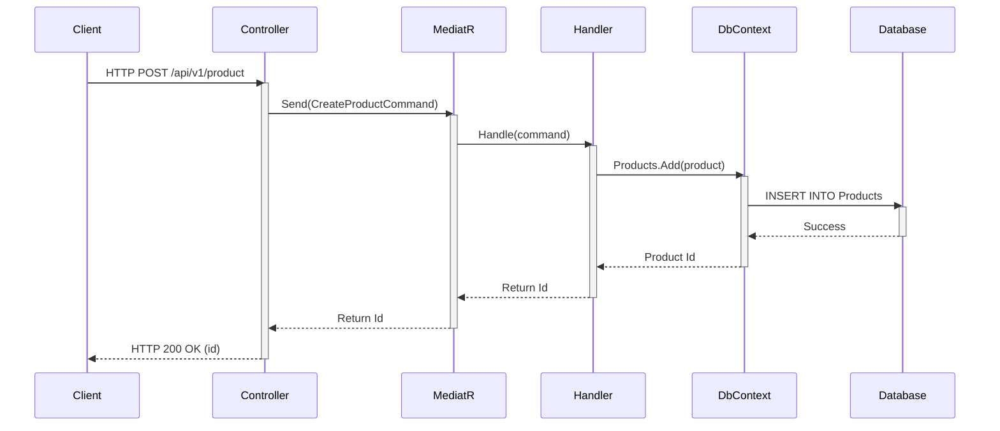

### Layer Interaction Example

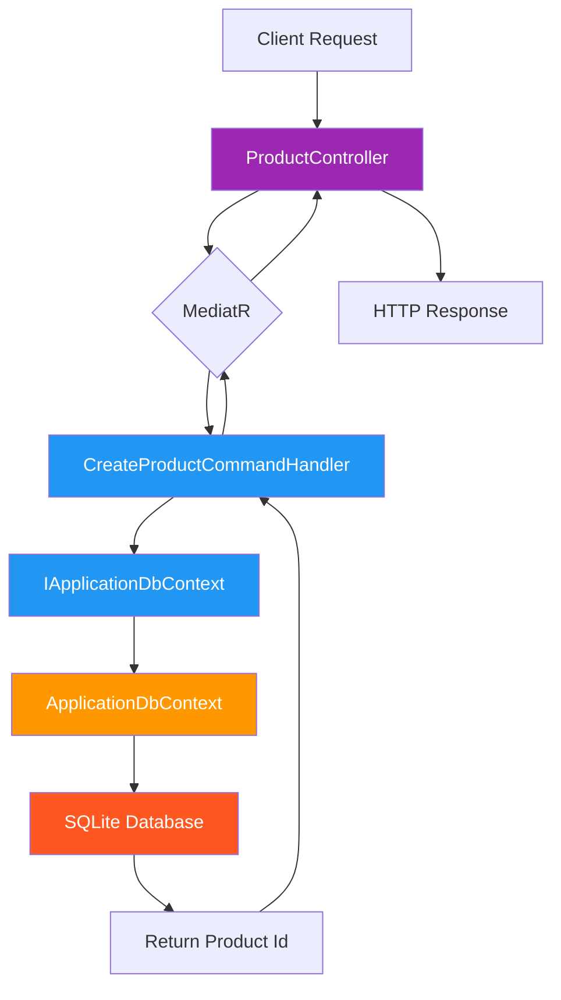

## CQRS Pattern

This application implements Command Query Responsibility Segregation (CQRS) using MediatR.

### Command Flow (Write Operations)


**Commands:**

- `CreateProductCommand` - Creates a new product
- `UpdateProductCommand` - Updates an existing product
- `DeleteProductByIdCommand` - Deletes a product

### Query Flow (Read Operations)

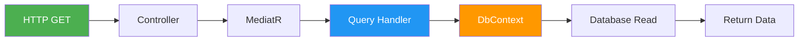

**Queries:**

- `GetAllProductsQuery` - Retrieves all products
- `GetProductByIdQuery` - Retrieves a single product by ID

### CQRS Benefits

1. **Separation of Concerns** - Read and write logic are separate
2. **Scalability** - Can optimize reads and writes independently
3. **Maintainability** - Each handler has a single responsibility
4. **Testability** - Easy to unit test individual handlers

## Database Architecture

### Entity Relationship Diagram

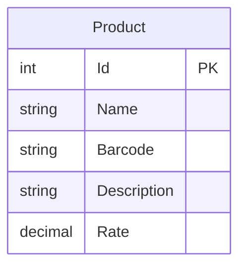

_Note: Currently, the application has a single entity. As the application grows, relationships between entities will be added here._

### Database Configuration

**Provider:** SQLite (development)
**Connection String:** `Data Source=onion.db`
**Migrations Assembly:** `Persistence`

**Configuration Location:**

- Connection string: `src/Presentation/WebApi/appsettings.json`
- DbContext setup: `src/Infrastructure/Persistence/DependencyInjection.cs`

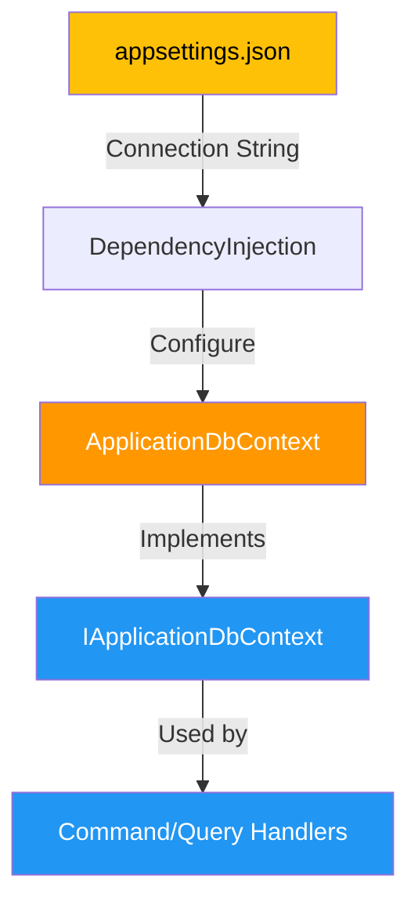

### Migration Strategy

```bash
# Create migration
cd src/Presentation/WebApi
dotnet ef migrations add MigrationName --project ../../Infrastructure/Persistence

# Apply migration
dotnet ef database update --project ../../Infrastructure/Persistence
```

## API Design

### Endpoint Structure

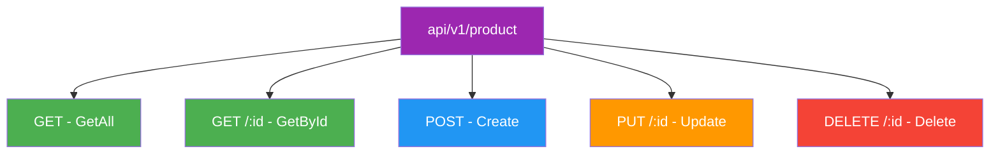

### API Versioning

The API uses URL-based versioning via `Asp.Versioning.Mvc`.

**Current Version:** v1.0
**Route Template:** `api/v{version:apiVersion}/[controller]`

**Example Endpoints:**

- `GET /api/v1/product` - Get all products
- `GET /api/v1/product/1` - Get product by ID
- `POST /api/v1/product` - Create product
- `PUT /api/v1/product/1` - Update product
- `DELETE /api/v1/product/1` - Delete product

### Controller Pattern

All controllers inherit from `BaseApiController`:

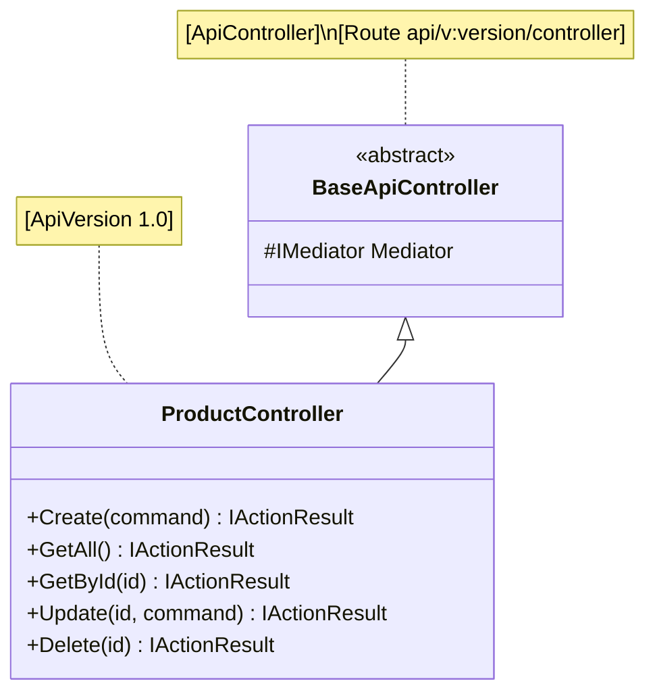

**Benefits:**

- Lazy-loaded MediatR instance
- Consistent routing across all controllers
- Reduced boilerplate code

## Dependency Injection

### Service Registration Flow

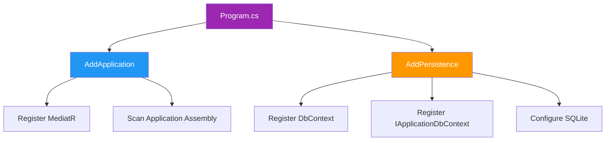

### Registration Order

1. **Application Layer** (`AddApplication`)
   - MediatR with all handlers from Application assembly

2. **Persistence Layer** (`AddPersistence`)
   - `ApplicationDbContext` as scoped service
   - `IApplicationDbContext` → `ApplicationDbContext` mapping
   - SQLite provider configuration

3. **Presentation Layer** (in `Program.cs`)
   - Controllers
   - API Versioning
   - Swagger/OpenAPI
   - Middleware pipeline

## Future Enhancements

### Recommended Architectural Improvements

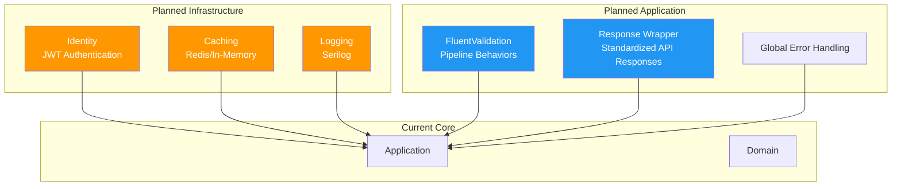

### 1. JWT Authentication

- Add `src/Infrastructure/Identity` project
- Implement user management and token generation
- Integrate with existing API

### 2. Response Wrapper

- Standardize all API responses
- Include success/error status
- Consistent error messaging

```json
{
  "succeeded": true,
  "data": { "id": 1 },
  "errors": [],
  "message": "Product created successfully"
}
```

### 3. FluentValidation

- Add validation pipeline behavior to MediatR
- Validate commands before reaching handlers
- Return consistent validation errors

### 4. Structured Logging

- Replace default logging with Serilog
- Add structured logging to all layers
- Implement correlation IDs for request tracking

### 5. Database Migration

- Switch from SQLite to PostgreSQL for production
- Update `UseSqlite` → `UseNpgsql`
- Add `Npgsql.EntityFrameworkCore.PostgreSQL` package

### 6. Testing Strategy

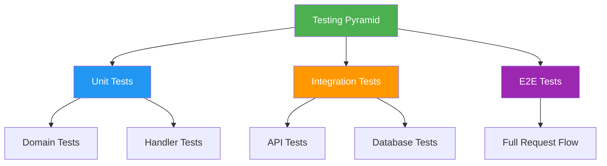

**Recommended Test Projects:**

- `tests/Domain.UnitTests` - Test domain entities and logic
- `tests/Application.UnitTests` - Test handlers with mocked dependencies
- `tests/Application.IntegrationTests` - Test with real database (in-memory)
- `tests/WebApi.IntegrationTests` - Test API endpoints end-to-end

---

## Summary

This Onion Architecture implementation provides:

- ✅ **Clear Separation of Concerns** - Each layer has a well-defined responsibility
- ✅ **Testability** - Dependencies point inward, making mocking easy
- ✅ **Maintainability** - Changes to infrastructure don't affect business logic
- ✅ **Scalability** - CQRS pattern allows independent optimization
- ✅ **Framework Independence** - Core business logic is not tied to ASP.NET Core

The architecture is production-ready and can be extended with the recommended enhancements as the application grows.
