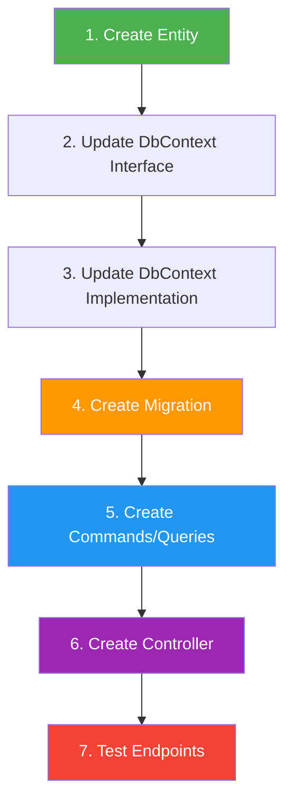
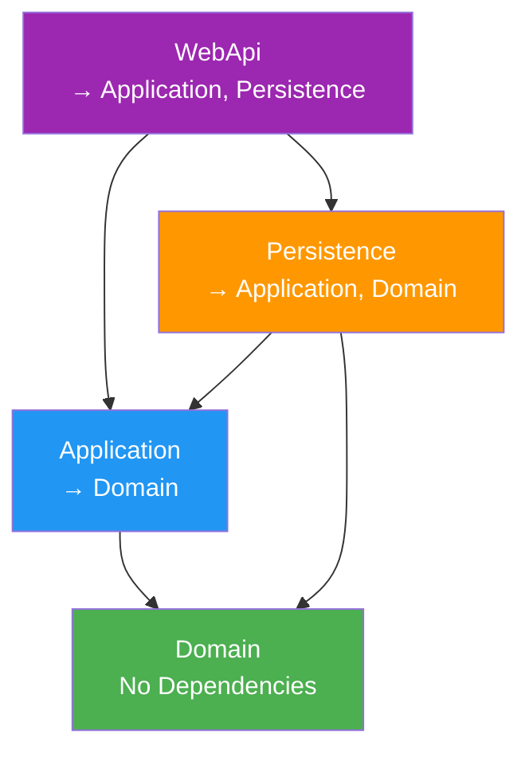

# Development Guide

## Getting Started

### Prerequisites

- .NET 10 SDK
- Visual Studio 2025, VS Code, or JetBrains Rider
- SQLite (included with .NET)
- Git

### Initial Setup

1. **Clone the repository**

   ```bash
   git clone <repository-url>
   cd OnionArchitecture
   ```

2. **Restore dependencies**

   ```bash
   dotnet restore
   ```

3. **Build the solution**

   ```bash
   dotnet build
   ```

4. **Apply database migrations**

   ```bash
   cd src/Presentation/WebApi
   dotnet ef database update --project ../../Infrastructure/Persistence
   ```

5. **Run the application**

   ```bash
   dotnet run
   ```

6. **Access Swagger UI**
   - Navigate to: `https://localhost:7130/swagger`

---

## Project Structure

```
OnionArchitecture/
├── src/
│   ├── Core/
│   │   ├── Domain/              # Enterprise business rules
│   │   │   ├── Common/          # Base classes
│   │   │   └── Entities/        # Domain entities
│   │   └── Application/         # Application business rules
│   │       ├── Features/        # CQRS commands & queries
│   │       ├── Interfaces/      # Abstractions
│   │       └── DependencyInjection.cs
│   ├── Infrastructure/
│   │   └── Persistence/         # Data access
│   │       ├── Context/         # DbContext
│   │       ├── Migrations/      # EF Core migrations
│   │       └── DependencyInjection.cs
│   └── Presentation/
│       └── WebApi/              # API endpoints
│           ├── Controllers/     # API controllers
│           └── Program.cs       # App entry point
├── docs/                        # Documentation
└── OnionArchitecture.sln        # Solution file
```

---

## Development Workflow

### Adding a New Feature

Follow these steps to add a new entity and its CRUD operations:



#### Step 1: Create Domain Entity

**Location:** `src/Core/Domain/Entities/`

```csharp
using Domain.Common;

namespace Domain.Entities;

public class Category : BaseEntity
{
    public string Name { get; set; } = string.Empty;
    public string Description { get; set; } = string.Empty;
}
```

#### Step 2: Update IApplicationDbContext

**Location:** `src/Core/Application/Interfaces/IApplicationDbContext.cs`

```csharp
public interface IApplicationDbContext
{
    DbSet<Product> Products { get; set; }
    DbSet<Category> Categories { get; set; } // Add this
    Task<int> SaveChangesAsync(CancellationToken cancellationToken = default);
}
```

#### Step 3: Update ApplicationDbContext

**Location:** `src/Infrastructure/Persistence/Context/ApplicationDbContext.cs`

```csharp
public class ApplicationDbContext : DbContext, IApplicationDbContext
{
    public ApplicationDbContext(DbContextOptions<ApplicationDbContext> options)
        : base(options) { }

    public DbSet<Product> Products { get; set; } = null!;
    public DbSet<Category> Categories { get; set; } = null!; // Add this
}
```

#### Step 4: Create Migration

```bash
cd src/Presentation/WebApi
dotnet ef migrations add AddCategoryEntity --project ../../Infrastructure/Persistence
dotnet ef database update --project ../../Infrastructure/Persistence
```

#### Step 5: Create Commands and Queries

**Location:** `src/Core/Application/Features/CategoryFeatures/Commands/`

**CreateCategoryCommand.cs:**

```csharp
using Application.Interfaces;
using Domain.Entities;
using MediatR;

namespace Application.Features.CategoryFeatures.Commands;

public record CreateCategoryCommand(
    string Name,
    string Description) : IRequest<int>;

public class CreateCategoryCommandHandler
    : IRequestHandler<CreateCategoryCommand, int>
{
    private readonly IApplicationDbContext _context;

    public CreateCategoryCommandHandler(IApplicationDbContext context)
        => _context = context;

    public async Task<int> Handle(
        CreateCategoryCommand request,
        CancellationToken cancellationToken)
    {
        var category = new Category
        {
            Name = request.Name,
            Description = request.Description
        };

        _context.Categories.Add(category);
        await _context.SaveChangesAsync(cancellationToken);
        return category.Id;
    }
}
```

**Location:** `src/Core/Application/Features/CategoryFeatures/Queries/`

**GetAllCategoriesQuery.cs:**

```csharp
using Application.Interfaces;
using Domain.Entities;
using MediatR;
using Microsoft.EntityFrameworkCore;

namespace Application.Features.CategoryFeatures.Queries;

public record GetAllCategoriesQuery() : IRequest<List<Category>>;

public class GetAllCategoriesQueryHandler
    : IRequestHandler<GetAllCategoriesQuery, List<Category>>
{
    private readonly IApplicationDbContext _context;

    public GetAllCategoriesQueryHandler(IApplicationDbContext context)
        => _context = context;

    public async Task<List<Category>> Handle(
        GetAllCategoriesQuery request,
        CancellationToken cancellationToken)
    {
        return await _context.Categories.ToListAsync(cancellationToken);
    }
}
```

#### Step 6: Create Controller

**Location:** `src/Presentation/WebApi/Controllers/v1/CategoryController.cs`

```csharp
using Application.Features.CategoryFeatures.Commands;
using Application.Features.CategoryFeatures.Queries;
using Asp.Versioning;
using Microsoft.AspNetCore.Mvc;

namespace WebApi.Controllers.v1;

[ApiVersion("1.0")]
public class CategoryController : BaseApiController
{
    [HttpPost]
    public async Task<IActionResult> Create([FromBody] CreateCategoryCommand command)
        => Ok(await Mediator.Send(command));

    [HttpGet]
    public async Task<IActionResult> GetAll()
        => Ok(await Mediator.Send(new GetAllCategoriesQuery()));
}
```

#### Step 7: Test

1. Run the application
2. Navigate to Swagger UI
3. Test the new endpoints

---

## Database Management

### Working with Migrations

#### Create a Migration

```bash
cd src/Presentation/WebApi
dotnet ef migrations add <MigrationName> --project ../../Infrastructure/Persistence
```

**Common migration names:**

- `AddCategoryEntity`
- `AddProductCategoryRelationship`
- `UpdateProductSchema`

#### Apply Migrations

```bash
# Update to latest migration
dotnet ef database update --project ../../Infrastructure/Persistence

# Update to specific migration
dotnet ef database update <MigrationName> --project ../../Infrastructure/Persistence

# Rollback all migrations
dotnet ef database update 0 --project ../../Infrastructure/Persistence
```

#### Remove Last Migration

```bash
dotnet ef migrations remove --project ../../Infrastructure/Persistence
```

**⚠️ Warning:** Only remove migrations that haven't been applied to other databases.

#### View Migration SQL

```bash
dotnet ef migrations script --project ../../Infrastructure/Persistence
```

### Database File Location

SQLite database file: `src/Presentation/WebApi/onion.db`

**⚠️ Note:** The `.db` file is git-ignored. Each developer has their own local database.

### Switching Database Providers

To switch from SQLite to PostgreSQL:

1. **Update the package reference** in `Persistence.csproj`:

   ```xml
   <!-- Remove -->
   <PackageReference Include="Microsoft.EntityFrameworkCore.Sqlite" Version="10.0.3" />

   <!-- Add -->
   <PackageReference Include="Npgsql.EntityFrameworkCore.PostgreSQL" Version="10.0.3" />
   ```

2. **Update DependencyInjection.cs** in Persistence:

   ```csharp
   // Change from
   options.UseSqlite(...)

   // To
   options.UseNpgsql(...)
   ```

3. **Update connection string** in `appsettings.json`:

   ```json
   {
     "ConnectionStrings": {
       "DefaultConnection": "Host=localhost;Database=oniondb;Username=postgres;Password=yourpassword"
     }
   }
   ```

4. **Remove old migrations and create new ones:**

   ```bash
   # Remove Migrations folder
   rm -rf src/Infrastructure/Persistence/Migrations

   # Create initial migration for PostgreSQL
   cd src/Presentation/WebApi
   dotnet ef migrations add InitialCreate --project ../../Infrastructure/Persistence
   dotnet ef database update --project ../../Infrastructure/Persistence
   ```

---

## Code Patterns and Conventions

### CQRS Command Pattern

```csharp
// Command (writes data)
public record CreateEntityCommand(prop1, prop2) : IRequest<TResult>;

// Handler
public class CreateEntityCommandHandler : IRequestHandler<CreateEntityCommand, TResult>
{
    private readonly IApplicationDbContext _context;

    public CreateEntityCommandHandler(IApplicationDbContext context)
        => _context = context;

    public async Task<TResult> Handle(
        CreateEntityCommand request,
        CancellationToken cancellationToken)
    {
        // Implementation
        await _context.SaveChangesAsync(cancellationToken);
        return result;
    }
}
```

### CQRS Query Pattern

```csharp
// Query (reads data)
public record GetEntityQuery(int Id) : IRequest<Entity>;

// Handler
public class GetEntityQueryHandler : IRequestHandler<GetEntityQuery, Entity>
{
    private readonly IApplicationDbContext _context;

    public GetEntityQueryHandler(IApplicationDbContext context)
        => _context = context;

    public async Task<Entity> Handle(
        GetEntityQuery request,
        CancellationToken cancellationToken)
    {
        return await _context.Entities
            .FirstOrDefaultAsync(e => e.Id == request.Id, cancellationToken);
    }
}
```

### Controller Pattern

```csharp
[ApiVersion("1.0")]
public class EntityController : BaseApiController
{
    // POST api/v1/entity
    [HttpPost]
    public async Task<IActionResult> Create([FromBody] CreateEntityCommand command)
        => Ok(await Mediator.Send(command));

    // GET api/v1/entity
    [HttpGet]
    public async Task<IActionResult> GetAll()
        => Ok(await Mediator.Send(new GetAllEntitiesQuery()));

    // GET api/v1/entity/1
    [HttpGet("{id:int}")]
    public async Task<IActionResult> GetById(int id)
        => Ok(await Mediator.Send(new GetEntityByIdQuery(id)));

    // PUT api/v1/entity/1
    [HttpPut("{id:int}")]
    public async Task<IActionResult> Update(int id, [FromBody] UpdateEntityCommand command)
    {
        if (id != command.Id)
            return BadRequest("Route id and body id do not match.");

        return Ok(await Mediator.Send(command));
    }

    // DELETE api/v1/entity/1
    [HttpDelete("{id:int}")]
    public async Task<IActionResult> Delete(int id)
        => Ok(await Mediator.Send(new DeleteEntityCommand(id)));
}
```

---

## Debugging

### Visual Studio / Rider

1. Set `WebApi` as the startup project
2. Press F5 or click "Run"
3. Set breakpoints in handlers or controllers

### VS Code

1. Open the project folder
2. Use the provided launch configuration (if available)
3. Or run manually:
   ```bash
   cd src/Presentation/WebApi
   dotnet run
   ```

### Logging

View logs in the console output. Default log level is `Information`.

To increase verbosity, update `appsettings.Development.json`:

```json
{
  "Logging": {
    "LogLevel": {
      "Default": "Debug",
      "Microsoft.AspNetCore": "Information",
      "Microsoft.EntityFrameworkCore.Database.Command": "Information"
    }
  }
}
```

**Enable SQL logging:**

```json
"Microsoft.EntityFrameworkCore.Database.Command": "Information"
```

---

## Testing Strategy

### Recommended Test Structure

```
tests/
├── Domain.UnitTests/              # Domain logic tests
├── Application.UnitTests/         # Handler tests (mocked dependencies)
├── Application.IntegrationTests/  # Handler tests (real DB)
└── WebApi.IntegrationTests/       # API endpoint tests
```

### Example Unit Test (Handler)

```csharp
public class CreateProductCommandHandlerTests
{
    [Fact]
    public async Task Handle_ShouldCreateProduct_AndReturnId()
    {
        // Arrange
        var context = CreateMockContext();
        var handler = new CreateProductCommandHandler(context);
        var command = new CreateProductCommand("Test", "123", "Desc", 10.00m);

        // Act
        var result = await handler.Handle(command, CancellationToken.None);

        // Assert
        Assert.True(result > 0);
    }
}
```

### Example Integration Test (API)

```csharp
public class ProductControllerTests : IClassFixture<WebApplicationFactory<Program>>
{
    private readonly HttpClient _client;

    public ProductControllerTests(WebApplicationFactory<Program> factory)
    {
        _client = factory.CreateClient();
    }

    [Fact]
    public async Task Create_ShouldReturnProductId()
    {
        // Arrange
        var command = new { name = "Test", barcode = "123", description = "Desc", rate = 10.00 };

        // Act
        var response = await _client.PostAsJsonAsync("/api/v1/product", command);

        // Assert
        response.EnsureSuccessStatusCode();
        var productId = await response.Content.ReadFromJsonAsync<int>();
        Assert.True(productId > 0);
    }
}
```

---

## Common Tasks

### Reset Database

```bash
cd src/Presentation/WebApi

# Delete the database file
rm onion.db

# Reapply migrations
dotnet ef database update --project ../../Infrastructure/Persistence
```

### View Database Contents

Use a SQLite viewer:

- **DB Browser for SQLite** (GUI)
- **SQLite CLI:**
  ```bash
  sqlite3 src/Presentation/WebApi/onion.db
  .tables
  SELECT * FROM Products;
  .quit
  ```

### Clean Build

```bash
# Clean all build artifacts
dotnet clean

# Remove bin and obj folders
find . -type d -name "bin" -o -name "obj" | xargs rm -rf

# Rebuild
dotnet build
```

### Update NuGet Packages

```bash
# Update all packages
dotnet list package --outdated
dotnet add package <PackageName>

# Or update in .csproj files and restore
dotnet restore
```

---

## Code Style and Guidelines

### Naming Conventions

- **Classes:** PascalCase (`ProductController`, `CreateProductCommand`)
- **Methods:** PascalCase (`Handle`, `GetAll`)
- **Properties:** PascalCase (`Name`, `Barcode`)
- **Parameters:** camelCase (`productId`, `cancellationToken`)
- **Private fields:** `_camelCase` (`_context`, `_mediator`)

### File Organization

- One class per file
- File name matches class name
- Organize files by feature, not by type
- Commands and handlers in the same file (for small handlers)

### Dependency Rules



**Rules:**

- ❌ Domain cannot reference any other project
- ❌ Application cannot reference Infrastructure or Presentation
- ❌ Persistence cannot reference WebApi
- ✅ WebApi can reference Application and Persistence
- ✅ Use interfaces to invert dependencies

---

## Troubleshooting

### Migration errors: "Build failed"

**Solution:** Build the solution first, then run migrations

```bash
dotnet build
cd src/Presentation/WebApi
dotnet ef migrations add ... --project ../../Infrastructure/Persistence
```

### Port already in use

**Solution:** Change ports in `launchSettings.json` or kill the process

```bash
# macOS/Linux
lsof -ti:5296 | xargs kill -9

# Windows
netstat -ano | findstr :5296
taskkill /PID <PID> /F
```

### Database locked (SQLite)

**Solution:** Close all connections or delete and recreate the database

```bash
cd src/Presentation/WebApi
rm onion.db
dotnet ef database update --project ../../Infrastructure/Persistence
```

### Swagger not loading

**Solution:** Ensure you're in Development environment

```bash
export ASPNETCORE_ENVIRONMENT=Development  # macOS/Linux
$env:ASPNETCORE_ENVIRONMENT="Development"  # Windows PowerShell
```

---

## Additional Resources

- [Architecture Documentation](./ARCHITECTURE.md)
- [API Documentation](./API.md)
- [.NET Documentation](https://docs.microsoft.com/dotnet)
- [Entity Framework Core Documentation](https://docs.microsoft.com/ef/core)
- [MediatR Documentation](https://github.com/jbogard/MediatR)

---

## Quick Command Reference

```bash
# Run application
cd src/Presentation/WebApi && dotnet run

# Build solution
dotnet build

# Clean solution
dotnet clean

# Restore packages
dotnet restore

# Create migration
cd src/Presentation/WebApi
dotnet ef migrations add <Name> --project ../../Infrastructure/Persistence

# Apply migrations
dotnet ef database update --project ../../Infrastructure/Persistence

# Reset database
rm src/Presentation/WebApi/onion.db
dotnet ef database update --project src/Infrastructure/Persistence
```
