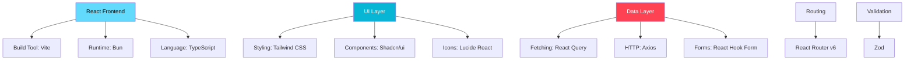
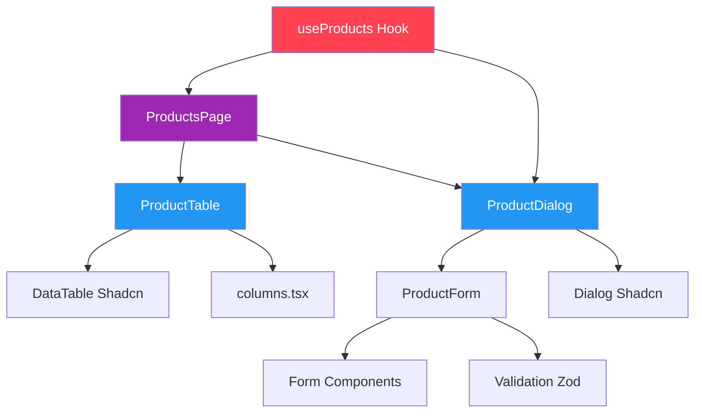

# React Frontend Architecture Plan

## Overview

This document outlines the plan to add a modern React frontend to the Onion Architecture backend using Vite, Bun, Tailwind CSS, Shadcn/ui, React Query, and DataTables.

**Created:** 2026-02-15
**Status:** Planning
**Target Completion:** TBD

---

## Table of Contents

- [Current State](#current-state)
- [Goals and Requirements](#goals-and-requirements)
- [Technology Stack](#technology-stack)
- [Project Structure](#project-structure)
- [Architecture Decisions](#architecture-decisions)
- [Implementation Plan](#implementation-plan)
- [API Integration](#api-integration)
- [Component Design](#component-design)
- [State Management](#state-management)
- [Testing Strategy](#testing-strategy)
- [Deployment](#deployment)

---

## Current State

### Backend API Analysis

**Endpoints:**
- `GET /api/v1/Product` - Get all products
- `GET /api/v1/Product/{id}` - Get product by ID
- `POST /api/v1/Product` - Create product
- `PUT /api/v1/Product/{id}` - Update product
- `DELETE /api/v1/Product/{id}` - Delete product

**Product Model:**
```typescript
{
  id: number;
  name: string;
  barcode: string;
  description: string;
  rate: number;
}
```

**Server:**
- Development: `http://localhost:5296` (HTTP), `https://localhost:7130` (HTTPS)
- No CORS configured (needs to be added)
- No authentication (public API)

**Database:** SQLite (`onion.db`)

---

## Goals and Requirements

### Functional Requirements

1. **Product Management**
   - View list of all products in a data table
   - Create new products via form dialog
   - Edit existing products via form dialog
   - Delete products with confirmation
   - Search/filter products
   - Sort products by columns

2. **User Experience**
   - Responsive design (mobile, tablet, desktop)
   - Loading states during API calls
   - Error handling with user-friendly messages
   - Success/error notifications (toasts)
   - Form validation with clear error messages

3. **Performance**
   - Fast initial load time
   - Optimistic updates where appropriate
   - Efficient re-rendering
   - Caching of API responses

### Non-Functional Requirements

1. **Developer Experience**
   - Type-safe development with TypeScript
   - Hot module replacement
   - Fast build times (using Vite and Bun)
   - Clear project structure
   - Reusable components

2. **Maintainability**
   - Consistent code style
   - Component composition
   - Separation of concerns
   - Well-documented code

3. **Accessibility**
   - Keyboard navigation
   - Screen reader support
   - ARIA labels
   - Semantic HTML

---

## Technology Stack

### Core Technologies



### Technology Justification

| Technology | Purpose | Why Chosen |
|------------|---------|------------|
| **React 18** | UI framework | Industry standard, large ecosystem, hooks API |
| **TypeScript** | Type safety | Catch errors at compile time, better IDE support |
| **Vite** | Build tool | Extremely fast HMR, modern ESM-based builds |
| **Bun** | Runtime/Package manager | Fastest package manager, modern JavaScript runtime |
| **Tailwind CSS** | Styling | Utility-first, fast development, small bundle size |
| **Shadcn/ui** | Component library | Accessible, customizable, not a dependency (copy/paste) |
| **React Query** | Data fetching | Powerful caching, automatic refetching, optimistic updates |
| **React Router** | Routing | Standard routing solution, v6 is declarative |
| **React Hook Form** | Form handling | Performant, minimal re-renders, great DX |
| **Zod** | Validation | Type-safe schema validation, integrates with RHF |
| **Axios** | HTTP client | Interceptors, request/response transformation |

---

## Project Structure

```
src/Presentation/web-app/
├── public/
│   └── vite.svg
├── src/
│   ├── components/
│   │   ├── ui/                    # Shadcn components (auto-generated)
│   │   │   ├── button.tsx
│   │   │   ├── card.tsx
│   │   │   ├── dialog.tsx
│   │   │   ├── form.tsx
│   │   │   ├── input.tsx
│   │   │   ├── label.tsx
│   │   │   ├── table.tsx
│   │   │   ├── dropdown-menu.tsx
│   │   │   ├── toast.tsx
│   │   │   └── ...
│   │   ├── products/              # Product-specific components
│   │   │   ├── ProductTable.tsx   # DataTable wrapper
│   │   │   ├── ProductForm.tsx    # Create/Edit form
│   │   │   ├── ProductDialog.tsx  # Modal for form
│   │   │   ├── columns.tsx        # Table column definitions
│   │   │   └── DeleteDialog.tsx   # Confirmation dialog
│   │   └── layout/                # Layout components
│   │       ├── Layout.tsx         # Main layout wrapper
│   │       ├── Header.tsx         # App header/nav
│   │       └── Footer.tsx         # App footer
│   ├── lib/
│   │   ├── api.ts                 # Axios instance & config
│   │   ├── utils.ts               # Shadcn cn() utility
│   │   └── queryClient.ts         # React Query config
│   ├── hooks/
│   │   ├── useProducts.ts         # Product CRUD hooks
│   │   └── useToast.ts            # Toast notifications (Shadcn)
│   ├── types/
│   │   ├── product.ts             # Product types
│   │   └── api.ts                 # API response types
│   ├── pages/
│   │   ├── ProductsPage.tsx       # Main products page
│   │   └── NotFoundPage.tsx       # 404 page
│   ├── App.tsx                    # Root component
│   ├── main.tsx                   # Entry point
│   └── index.css                  # Global styles + Tailwind
├── .env.development               # Dev environment variables
├── .env.production                # Prod environment variables
├── components.json                # Shadcn configuration
├── package.json                   # Dependencies & scripts
├── tsconfig.json                  # TypeScript config
├── vite.config.ts                 # Vite config
├── tailwind.config.js             # Tailwind config
├── postcss.config.js              # PostCSS config
└── README.md                      # Frontend documentation
```

---

## Architecture Decisions

### 1. Component Architecture

**Atomic Design Principles:**
- **Atoms:** Basic UI components from Shadcn (Button, Input, etc.)
- **Molecules:** Composed components (ProductForm, ProductDialog)
- **Organisms:** Complex components (ProductTable)
- **Templates:** Layout components (Layout, Header)
- **Pages:** Route components (ProductsPage)

**Component Communication:**


### 2. State Management Strategy

**Server State:** React Query
- Product data fetching
- Mutations (create, update, delete)
- Automatic caching
- Background refetching
- Optimistic updates

**Client State:** React useState/useReducer
- Form state (React Hook Form manages this)
- UI state (dialog open/closed, selected rows)
- Local filtering/sorting (DataTable manages this)

**Global State:** Not needed currently
- No authentication state
- No complex app-wide state
- Context API can be added later if needed

### 3. Data Fetching Pattern

**React Query Hooks Architecture:**

```typescript
// hooks/useProducts.ts

// Query hooks
export function useProducts() {
  return useQuery({
    queryKey: ['products'],
    queryFn: fetchProducts,
    staleTime: 5 * 60 * 1000, // 5 minutes
  });
}

export function useProduct(id: number) {
  return useQuery({
    queryKey: ['products', id],
    queryFn: () => fetchProduct(id),
    enabled: !!id,
  });
}

// Mutation hooks
export function useCreateProduct() {
  const queryClient = useQueryClient();

  return useMutation({
    mutationFn: createProduct,
    onSuccess: () => {
      queryClient.invalidateQueries({ queryKey: ['products'] });
      toast.success('Product created successfully');
    },
  });
}

export function useUpdateProduct() {
  const queryClient = useQueryClient();

  return useMutation({
    mutationFn: updateProduct,
    onSuccess: () => {
      queryClient.invalidateQueries({ queryKey: ['products'] });
      toast.success('Product updated successfully');
    },
  });
}

export function useDeleteProduct() {
  const queryClient = useQueryClient();

  return useMutation({
    mutationFn: deleteProduct,
    onSuccess: () => {
      queryClient.invalidateQueries({ queryKey: ['products'] });
      toast.success('Product deleted successfully');
    },
  });
}
```

### 4. Validation Strategy with Zod

**Why Zod:**
- Type-safe schema validation
- Runtime validation with TypeScript inference
- Custom error messages
- Composable schemas
- Integration with React Hook Form

**Centralized Schemas:**

All validation schemas are defined in `src/types/product.ts`:

```typescript
import { z } from 'zod';

// Base product schema
export const productSchema = z.object({
  id: z.number().int().positive(),
  name: z.string()
    .min(1, 'Name is required')
    .max(100, 'Name must be less than 100 characters')
    .trim(),
  barcode: z.string()
    .min(1, 'Barcode is required')
    .max(50, 'Barcode must be less than 50 characters')
    .regex(/^[A-Za-z0-9-]+$/, 'Barcode can only contain letters, numbers, and hyphens'),
  description: z.string()
    .min(1, 'Description is required')
    .max(500, 'Description must be less than 500 characters'),
  rate: z.number()
    .min(0, 'Rate must be a positive number')
    .max(999999.99, 'Rate is too large')
    .multipleOf(0.01, 'Rate can have at most 2 decimal places'),
});

// Schema for creating products (no ID required)
export const createProductSchema = productSchema.omit({ id: true });

// Schema for updating products (ID required)
export const updateProductSchema = productSchema;

// Infer TypeScript types from schemas
export type Product = z.infer<typeof productSchema>;
export type CreateProductRequest = z.infer<typeof createProductSchema>;
export type UpdateProductRequest = z.infer<typeof updateProductSchema>;
export type ProductFormData = z.infer<typeof createProductSchema>;
```

### 5. Form Handling Pattern

**React Hook Form + Zod Integration:**

```typescript
import { useForm } from 'react-hook-form';
import { zodResolver } from '@hookform/resolvers/zod';
import { createProductSchema, type ProductFormData } from '@/types/product';

// In ProductForm component
const form = useForm<ProductFormData>({
  resolver: zodResolver(createProductSchema),
  mode: 'onChange', // Validate on every change
  defaultValues: product || {
    name: '',
    barcode: '',
    description: '',
    rate: 0,
  },
});

const onSubmit = (data: ProductFormData) => {
  // Data is already validated by Zod at this point
  createProduct(data);
};
```

**Benefits:**
- Single source of truth for validation
- Automatic error display via Shadcn Form
- Type-safe form data
- Real-time validation feedback
- Server-side errors can be merged with form errors

---

## Implementation Plan

### Phase 1: Project Setup (Day 1)

**Tasks:**
1. ✅ Initialize Vite + React + TypeScript project with Bun
2. ✅ Install and configure Tailwind CSS
3. ✅ Setup Shadcn/ui CLI and install base components
4. ✅ Configure environment variables
5. ✅ Setup project folder structure
6. ✅ Add CORS to backend API

**Deliverable:** Working dev server with Tailwind and Shadcn configured

### Phase 2: API Integration (Day 1-2)

**Tasks:**
1. ✅ Create TypeScript types for Product
2. ✅ Setup Axios client with base configuration
3. ✅ Create React Query hooks for all CRUD operations
4. ✅ Setup React Query QueryClient provider
5. ✅ Test all API endpoints

**Deliverable:** Working API integration layer with type safety

### Phase 3: Core Components (Day 2-3)

**Tasks:**
1. ✅ Create Layout component
2. ✅ Create Header component
3. ✅ Setup React Router
4. ✅ Create ProductsPage skeleton
5. ✅ Install necessary Shadcn components

**Deliverable:** Basic app structure with routing

### Phase 4: Product Table (Day 3-4)

**Tasks:**
1. ✅ Define table columns with sorting/filtering
2. ✅ Create ProductTable component with Shadcn DataTable
3. ✅ Implement search functionality
4. ✅ Implement column sorting
5. ✅ Implement pagination
6. ✅ Add action column (Edit, Delete)
7. ✅ Integrate with useProducts hook

**Deliverable:** Fully functional product listing with DataTable

### Phase 5: Product Forms (Day 4-5)

**Tasks:**
1. ✅ Create Zod validation schema
2. ✅ Create ProductForm component with React Hook Form
3. ✅ Create ProductDialog wrapper
4. ✅ Wire up create mutation
5. ✅ Wire up update mutation
6. ✅ Add loading states
7. ✅ Add error handling

**Deliverable:** Working create and edit functionality

### Phase 6: Delete Functionality (Day 5)

**Tasks:**
1. ✅ Create DeleteDialog confirmation component
2. ✅ Wire up delete mutation
3. ✅ Add optimistic updates (optional)
4. ✅ Add success/error toasts

**Deliverable:** Working delete functionality

### Phase 7: Polish & UX (Day 6)

**Tasks:**
1. ✅ Add loading skeletons for table
2. ✅ Add empty state when no products
3. ✅ Improve error messages
4. ✅ Add toast notifications for all actions
5. ✅ Responsive design improvements
6. ✅ Accessibility improvements

**Deliverable:** Production-ready user experience

### Phase 8: Testing & Documentation (Day 7)

**Tasks:**
1. ✅ Manual testing of all features
2. ✅ Cross-browser testing
3. ✅ Update documentation
4. ✅ Create README for frontend
5. ✅ Production build test

**Deliverable:** Tested and documented frontend

---

## API Integration

### API Client Setup

**File: `src/lib/api.ts`**

```typescript
import axios from 'axios';

const API_BASE_URL = import.meta.env.VITE_API_BASE_URL || 'http://localhost:5296/api/v1';

export const api = axios.create({
  baseURL: API_BASE_URL,
  headers: {
    'Content-Type': 'application/json',
  },
});

// Request interceptor (for future auth tokens)
api.interceptors.request.use(
  (config) => {
    // Add auth token here when implemented
    return config;
  },
  (error) => {
    return Promise.reject(error);
  }
);

// Response interceptor (for error handling)
api.interceptors.response.use(
  (response) => response,
  (error) => {
    // Global error handling
    const message = error.response?.data?.message || error.message || 'An error occurred';
    console.error('API Error:', message);
    return Promise.reject(error);
  }
);
```

### API Service Layer

**File: `src/lib/productService.ts`**

```typescript
import { api } from './api';
import type { Product, CreateProductRequest, UpdateProductRequest } from '../types/product';

export const productService = {
  // Get all products
  getAll: async (): Promise<Product[]> => {
    const response = await api.get<Product[]>('/Product');
    return response.data;
  },

  // Get single product
  getById: async (id: number): Promise<Product> => {
    const response = await api.get<Product>(`/Product/${id}`);
    return response.data;
  },

  // Create product
  create: async (data: CreateProductRequest): Promise<number> => {
    const response = await api.post<number>('/Product', data);
    return response.data;
  },

  // Update product
  update: async (id: number, data: UpdateProductRequest): Promise<number> => {
    const response = await api.put<number>(`/Product/${id}`, data);
    return response.data;
  },

  // Delete product
  delete: async (id: number): Promise<number> => {
    const response = await api.delete<number>(`/Product/${id}`);
    return response.data;
  },
};
```

### Environment Configuration

**File: `.env.development`**

```bash
VITE_API_BASE_URL=http://localhost:5296/api/v1
```

**File: `.env.production`**

```bash
VITE_API_BASE_URL=https://api.production.com/api/v1
```

---

## Component Design

### ProductTable Component

**Responsibilities:**
- Display products in a data table
- Handle sorting, filtering, pagination
- Show action buttons (Edit, Delete)
- Handle loading and error states

**Props:**
```typescript
interface ProductTableProps {
  onEdit: (product: Product) => void;
  onDelete: (product: Product) => void;
}
```

**Features:**
- Column sorting (by Name, ID, Rate)
- Global search across all columns
- Pagination (10, 20, 50 rows per page)
- Row actions dropdown
- Empty state placeholder
- Loading skeleton

### ProductForm Component

**Responsibilities:**
- Render form fields for product data
- Handle validation
- Submit data to parent

**Props:**
```typescript
interface ProductFormProps {
  product?: Product;  // undefined for create, defined for edit
  onSubmit: (data: CreateProductRequest | UpdateProductRequest) => void;
  isLoading?: boolean;
}
```

**Validation:**
- Name: Required, min 1 character
- Barcode: Required, min 1 character
- Description: Required
- Rate: Required, must be >= 0, must be a number

### ProductDialog Component

**Responsibilities:**
- Wrap ProductForm in a Dialog
- Handle dialog open/close state
- Trigger mutations on form submit
- Show loading state during mutation

**Props:**
```typescript
interface ProductDialogProps {
  mode: 'create' | 'edit';
  product?: Product;
  open: boolean;
  onOpenChange: (open: boolean) => void;
}
```

---

## Validation with Zod

### Overview

Zod provides type-safe schema validation for the entire application. All validation rules are centralized in schema definitions, ensuring consistency between runtime validation and TypeScript types.

### Validation Schema Architecture

**File: `src/types/product.ts`**

```typescript
import { z } from 'zod';

// Base product schema with full validation
export const productSchema = z.object({
  id: z.number().int().positive(),
  name: z.string()
    .min(1, 'Name is required')
    .max(100, 'Name must be less than 100 characters')
    .trim(),
  barcode: z.string()
    .min(1, 'Barcode is required')
    .max(50, 'Barcode must be less than 50 characters')
    .regex(/^[A-Za-z0-9-]+$/, 'Barcode can only contain letters, numbers, and hyphens')
    .trim(),
  description: z.string()
    .min(1, 'Description is required')
    .max(500, 'Description must be less than 500 characters')
    .trim(),
  rate: z.coerce.number()
    .min(0, 'Rate must be a positive number')
    .max(999999.99, 'Rate cannot exceed 999,999.99')
    .multipleOf(0.01, 'Rate can have at most 2 decimal places'),
});

// Create schema (omit ID)
export const createProductSchema = productSchema.omit({ id: true });

// Update schema (same as base)
export const updateProductSchema = productSchema;

// TypeScript types inferred from schemas
export type Product = z.infer<typeof productSchema>;
export type CreateProductRequest = z.infer<typeof createProductSchema>;
export type UpdateProductRequest = z.infer<typeof updateProductSchema>;
export type ProductFormData = z.infer<typeof createProductSchema>;
```

### Integration with React Hook Form

**File: `src/components/products/ProductForm.tsx`**

```typescript
import { useForm } from 'react-hook-form';
import { zodResolver } from '@hookform/resolvers/zod';
import { createProductSchema, type ProductFormData } from '@/types/product';
import { Form, FormControl, FormField, FormItem, FormLabel, FormMessage } from '@/components/ui/form';
import { Input } from '@/components/ui/input';
import { Textarea } from '@/components/ui/textarea';

interface ProductFormProps {
  defaultValues?: ProductFormData;
  onSubmit: (data: ProductFormData) => void;
  isSubmitting?: boolean;
}

export function ProductForm({ defaultValues, onSubmit, isSubmitting }: ProductFormProps) {
  const form = useForm<ProductFormData>({
    resolver: zodResolver(createProductSchema),
    mode: 'onChange', // Validate on change
    defaultValues: defaultValues || {
      name: '',
      barcode: '',
      description: '',
      rate: 0,
    },
  });

  return (
    <Form {...form}>
      <form onSubmit={form.handleSubmit(onSubmit)} className="space-y-4">
        <FormField
          control={form.control}
          name="name"
          render={({ field }) => (
            <FormItem>
              <FormLabel>Name</FormLabel>
              <FormControl>
                <Input placeholder="Product name" {...field} />
              </FormControl>
              <FormMessage /> {/* Automatically shows Zod error messages */}
            </FormItem>
          )}
        />

        <FormField
          control={form.control}
          name="barcode"
          render={({ field }) => (
            <FormItem>
              <FormLabel>Barcode</FormLabel>
              <FormControl>
                <Input placeholder="Product barcode" {...field} />
              </FormControl>
              <FormMessage />
            </FormItem>
          )}
        />

        <FormField
          control={form.control}
          name="description"
          render={({ field }) => (
            <FormItem>
              <FormLabel>Description</FormLabel>
              <FormControl>
                <Textarea placeholder="Product description" {...field} />
              </FormControl>
              <FormMessage />
            </FormItem>
          )}
        />

        <FormField
          control={form.control}
          name="rate"
          render={({ field }) => (
            <FormItem>
              <FormLabel>Rate</FormLabel>
              <FormControl>
                <Input
                  type="number"
                  step="0.01"
                  placeholder="0.00"
                  {...field}
                  onChange={(e) => field.onChange(parseFloat(e.target.value))}
                />
              </FormControl>
              <FormMessage />
            </FormItem>
          )}
        />

        <Button type="submit" disabled={isSubmitting}>
          {isSubmitting ? 'Saving...' : 'Save Product'}
        </Button>
      </form>
    </Form>
  );
}
```

### Validation Features

**1. Client-Side Validation**
- Immediate feedback as user types (mode: 'onChange')
- Error messages defined in Zod schema
- No need to write custom validation logic

**2. Type Safety**
- Form data types automatically inferred from Zod schemas
- Compile-time errors if form doesn't match schema
- IDE autocomplete for form fields

**3. Custom Validation Rules**
```typescript
// Email validation (future enhancement)
email: z.string().email('Invalid email address'),

// URL validation
websiteUrl: z.string().url('Must be a valid URL').optional(),

// Custom regex validation
sku: z.string().regex(/^SKU-\d{6}$/, 'SKU must match format SKU-######'),

// Conditional validation
stock: z.number().refine(
  (val) => val >= 0,
  { message: 'Stock cannot be negative' }
),

// Cross-field validation
z.object({
  minPrice: z.number(),
  maxPrice: z.number(),
}).refine((data) => data.maxPrice > data.minPrice, {
  message: "Max price must be greater than min price",
  path: ["maxPrice"],
});
```

**4. Transform and Coerce**
```typescript
// Automatically convert string to number
rate: z.coerce.number(),

// Transform and trim strings
name: z.string().trim().toLowerCase(),

// Parse dates
createdAt: z.string().pipe(z.coerce.date()),
```

### Error Handling

**Display Validation Errors:**
```typescript
// Individual field errors
<FormMessage /> // Automatically shows field-specific errors

// Form-level errors
{form.formState.errors.root && (
  <Alert variant="destructive">
    <AlertDescription>{form.formState.errors.root.message}</AlertDescription>
  </Alert>
)}
```

**Server-Side Validation Errors:**
```typescript
// Merge server errors with form errors
const handleSubmit = async (data: ProductFormData) => {
  try {
    await createProduct(data);
  } catch (error) {
    if (error.response?.data?.errors) {
      // Set server errors on form
      Object.entries(error.response.data.errors).forEach(([field, message]) => {
        form.setError(field as keyof ProductFormData, {
          type: 'server',
          message: message as string,
        });
      });
    }
  }
};
```

### Benefits of Zod

1. **Single Source of Truth**
   - Validation rules defined once
   - Used for both runtime and compile-time validation

2. **Developer Experience**
   - Type inference eliminates duplicate type definitions
   - Composable schemas
   - Descriptive error messages

3. **Runtime Safety**
   - Catches invalid data at runtime
   - Prevents bad data from reaching the API
   - Can validate API responses too

4. **Easy to Extend**
   - Add new validation rules easily
   - Reuse schemas across components
   - Create custom validators

### Future Enhancements

**1. API Response Validation**
```typescript
// Validate API responses to ensure type safety
const validateProductResponse = (data: unknown): Product => {
  return productSchema.parse(data);
};

export const productService = {
  getById: async (id: number): Promise<Product> => {
    const response = await api.get(`/Product/${id}`);
    return validateProductResponse(response.data);
  },
};
```

**2. Schema Composition**
```typescript
// Reusable base schemas
const baseProductFields = {
  name: z.string().min(1).max(100),
  description: z.string().min(1).max(500),
};

// Compose schemas
const createProductSchema = z.object({
  ...baseProductFields,
  barcode: z.string().min(1),
  rate: z.number().min(0),
});
```

**3. Async Validation**
```typescript
// Check if barcode is unique
barcode: z.string().refine(
  async (barcode) => {
    const exists = await checkBarcodeExists(barcode);
    return !exists;
  },
  { message: 'Barcode already exists' }
);
```

---

## State Management

### React Query Configuration

**File: `src/lib/queryClient.ts`**

```typescript
import { QueryClient } from '@tanstack/react-query';

export const queryClient = new QueryClient({
  defaultOptions: {
    queries: {
      staleTime: 5 * 60 * 1000, // 5 minutes
      cacheTime: 10 * 60 * 1000, // 10 minutes
      retry: 1,
      refetchOnWindowFocus: false,
    },
    mutations: {
      retry: 0,
    },
  },
});
```

### Query Keys

```typescript
// Organized query keys
export const queryKeys = {
  products: {
    all: ['products'] as const,
    detail: (id: number) => ['products', id] as const,
  },
};
```

---

## Testing Strategy

### Manual Testing Checklist

- [ ] Create product with valid data
- [ ] Create product with invalid data (validation)
- [ ] Edit existing product
- [ ] Delete product (with confirmation)
- [ ] Sort table by each column
- [ ] Filter/search products
- [ ] Pagination controls
- [ ] Loading states display correctly
- [ ] Error states display correctly
- [ ] Toast notifications appear
- [ ] Responsive design (mobile, tablet, desktop)
- [ ] Keyboard navigation works
- [ ] Screen reader accessibility

### Future: Automated Testing

**Unit Tests (Vitest + React Testing Library):**
- Component rendering
- Form validation
- Event handlers
- Custom hooks

**Integration Tests:**
- API integration
- React Query cache behavior
- Form submission flows

**E2E Tests (Playwright):**
- Complete user flows
- CRUD operations
- Error scenarios

---

## Deployment

### Build Process

```bash
# Production build
bun run build

# Output: dist/ folder with optimized assets
```

### Deployment Options

1. **Static Hosting** (Vercel, Netlify, Cloudflare Pages)
   - Deploy `dist/` folder
   - Configure environment variables
   - Set up custom domain

2. **Docker** (with nginx)
   - Create Dockerfile for frontend
   - Serve static files with nginx
   - Include in docker-compose with backend

3. **Same Server as Backend**
   - Build frontend
   - Copy `dist/` to backend's `wwwroot/`
   - Serve via ASP.NET Core static files

---

## Future Enhancements

### Short Term
- [ ] Add loading skeletons for better UX
- [ ] Implement optimistic updates for mutations
- [ ] Add bulk delete functionality
- [ ] Export products to CSV
- [ ] Add product images

### Medium Term
- [ ] Add authentication (JWT)
- [ ] User management
- [ ] Role-based access control
- [ ] Advanced filtering (date range, multiple filters)
- [ ] Product categories/tags

### Long Term
- [ ] Multi-language support (i18n)
- [ ] Dark mode
- [ ] Offline support (PWA)
- [ ] Real-time updates (SignalR)
- [ ] Advanced analytics dashboard

---

## Dependencies Reference

### Core Dependencies
```json
{
  "react": "^18.3.1",
  "react-dom": "^18.3.1",
  "react-router-dom": "^6.22.0",
  "@tanstack/react-query": "^5.22.0",
  "axios": "^1.6.7",
  "react-hook-form": "^7.50.1",
  "@hookform/resolvers": "^3.3.4",
  "zod": "^3.22.4"
}
```

### Dev Dependencies
```json
{
  "typescript": "^5.3.3",
  "vite": "^5.1.0",
  "@vitejs/plugin-react": "^4.2.1",
  "tailwindcss": "^3.4.1",
  "postcss": "^8.4.35",
  "autoprefixer": "^10.4.17"
}
```

### Shadcn Components
- button
- card
- dialog
- form
- input
- label
- table
- dropdown-menu
- toast
- select
- textarea

---

## Conclusion

This plan provides a comprehensive roadmap for implementing a modern React frontend for the Onion Architecture backend. The technology choices prioritize:

- **Developer Experience:** Fast builds, type safety, great tooling
- **User Experience:** Responsive, accessible, performant
- **Maintainability:** Clean architecture, reusable components
- **Scalability:** Easy to extend with new features

The implementation is structured in phases to allow for incremental delivery and testing. Each phase builds upon the previous one, ensuring a solid foundation at every step.

---

**Next Steps:**
1. Review and approve this plan
2. Setup development environment (install Bun)
3. Begin Phase 1: Project Setup
4. Follow the implementation plan phase by phase

**Questions or concerns?** Please review and provide feedback before implementation begins.
