# Documentation

Welcome to the Onion Architecture documentation. This directory contains comprehensive guides and reference materials for developers working with this codebase.

## Documentation Index

### 📖 [ARCHITECTURE.md](./ARCHITECTURE.md)

**System Architecture Documentation**

Comprehensive overview of the system architecture including:

- Onion Architecture pattern explanation
- Layer-by-layer breakdown with diagrams
- Request flow and lifecycle
- CQRS pattern implementation
- Database architecture
- Dependency injection strategy
- Future enhancement roadmap

**Best for:** Understanding the big picture, architectural decisions, and how components interact.

---

### 🚀 [DEVELOPMENT.md](./DEVELOPMENT.md)

**Development Guide**

Practical guide for day-to-day development:

- Getting started and initial setup
- Step-by-step guide to adding new features
- Database migration workflows
- Code patterns and conventions
- Debugging tips
- Testing strategies
- Troubleshooting common issues
- Command reference

**Best for:** New developers getting started, adding features, and solving common problems.

---

### 🌐 [API.md](./API.md)

**API Documentation**

Complete API reference:

- All endpoints with request/response examples
- Data models and schemas
- cURL examples
- Testing with Swagger UI
- API versioning
- Error handling
- Performance considerations

**Best for:** Frontend developers, API consumers, and testing the API.

---

## Quick Navigation

### I want to...

**Understand the architecture**
→ Read [ARCHITECTURE.md](./ARCHITECTURE.md)

**Set up my development environment**
→ Follow [DEVELOPMENT.md - Getting Started](./DEVELOPMENT.md#getting-started)

**Add a new feature**
→ Follow [DEVELOPMENT.md - Adding a New Feature](./DEVELOPMENT.md#adding-a-new-feature)

**Learn about the API endpoints**
→ Read [API.md](./API.md)

**Understand the request flow**
→ See [ARCHITECTURE.md - Request Flow](./ARCHITECTURE.md#request-flow)

**Work with database migrations**
→ Follow [DEVELOPMENT.md - Database Management](./DEVELOPMENT.md#database-management)

**Understand CQRS pattern**
→ Read [ARCHITECTURE.md - CQRS Pattern](./ARCHITECTURE.md#cqrs-pattern) and [DEVELOPMENT.md - Code Patterns](./DEVELOPMENT.md#code-patterns-and-conventions)

**Test the API**
→ Follow [API.md - Testing](./API.md#testing-the-api)

**Troubleshoot an issue**
→ Check [DEVELOPMENT.md - Troubleshooting](./DEVELOPMENT.md#troubleshooting)

---

## Visual Overview

```mermaid
graph TB
    subgraph "Documentation"
        ARCH[ARCHITECTURE.md<br/>📐 System Design]
        DEV[DEVELOPMENT.md<br/>💻 Developer Guide]
        API[API.md<br/>🌐 API Reference]
    end

    subgraph "Use Cases"
        NEW[New Developer]
        FE[Frontend Dev]
        BE[Backend Dev]
    end

    NEW --> DEV
    NEW --> ARCH
    FE --> API
    BE --> DEV
    BE --> ARCH

    style ARCH fill:#4CAF50,color:#fff
    style DEV fill:#2196F3,color:#fff
    style API fill:#9C27B0,color:#fff
```



---

## Key Concepts

### Onion Architecture

The application is organized in concentric layers where dependencies point inward:

- **Domain** (innermost) - Business entities, no dependencies
- **Application** - Business logic, depends on Domain
- **Infrastructure** - Data access, depends on Application and Domain
- **Presentation** (outermost) - API controllers, depends on Application and Infrastructure

See [ARCHITECTURE.md - Architecture Pattern](./ARCHITECTURE.md#architecture-pattern) for detailed explanation.

### CQRS Pattern

Commands (write operations) and Queries (read operations) are separated:

- Commands modify state and may return simple results
- Queries read data without side effects
- Both use MediatR for dispatch

See [ARCHITECTURE.md - CQRS Pattern](./ARCHITECTURE.md#cqrs-pattern) for implementation details.

### Feature-Based Organization

Code is organized by feature rather than technical type:

```
Features/
  ProductFeatures/
    Commands/
      CreateProductCommand.cs
      UpdateProductCommand.cs
    Queries/
      GetAllProductsQuery.cs
      GetProductByIdQuery.cs
```

See [DEVELOPMENT.md - Adding a New Feature](./DEVELOPMENT.md#adding-a-new-feature) for the workflow.

---

## Common Commands

```bash
# Run the application
cd src/Presentation/WebApi && dotnet run

# Create a migration
cd src/Presentation/WebApi
dotnet ef migrations add <Name> --project ../../Infrastructure/Persistence

# Apply migrations
dotnet ef database update --project ../../Infrastructure/Persistence

# Access Swagger UI
# Navigate to: https://localhost:7130/swagger
```

See [DEVELOPMENT.md - Quick Command Reference](./DEVELOPMENT.md#quick-command-reference) for more.

---

## Technology Stack

- **.NET 10** - Application framework
- **ASP.NET Core** - Web API framework
- **Entity Framework Core** - ORM
- **MediatR** - CQRS implementation
- **SQLite** - Database (development)
- **Swagger/OpenAPI** - API documentation
- **Asp.Versioning** - API versioning

---

## Contributing

When updating documentation:

1. **ARCHITECTURE.md** - Update when changing architectural patterns, adding layers, or modifying core structure
2. **DEVELOPMENT.md** - Update when adding new workflows, patterns, or development processes
3. **API.md** - Update when adding/modifying endpoints or changing API behavior
4. **README.md** (this file) - Update when adding new documentation files

Keep diagrams up-to-date using [Mermaid syntax](https://mermaid.js.org/).

---

## External Resources

- [.NET Documentation](https://docs.microsoft.com/dotnet)
- [Entity Framework Core](https://docs.microsoft.com/ef/core)
- [MediatR GitHub](https://github.com/jbogard/MediatR)
- [Onion Architecture by Jeffrey Palermo](https://jeffreypalermo.com/2008/07/the-onion-architecture-part-1/)
- [Clean Architecture by Robert C. Martin](https://blog.cleancoder.com/uncle-bob/2012/08/13/the-clean-architecture.html)

---

## Need Help?

1. **Read the docs** - Most questions are answered in the guides above
2. **Check troubleshooting** - See [DEVELOPMENT.md - Troubleshooting](./DEVELOPMENT.md#troubleshooting)
3. **Review examples** - All docs include code examples and diagrams
4. **Ask the team** - If still stuck, reach out to the development team

---

Last Updated: 2026-02-15
